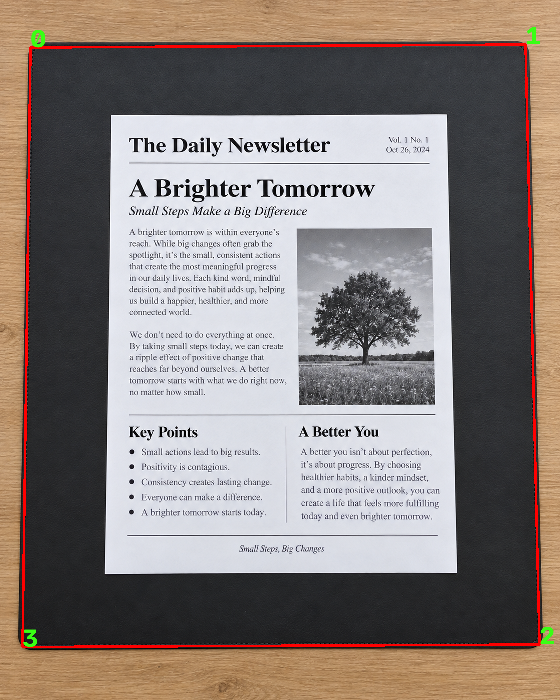
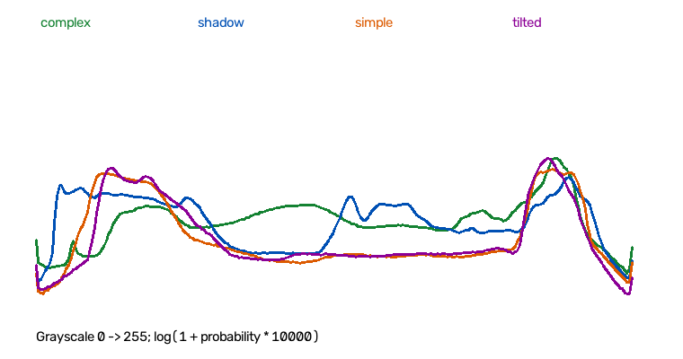

# 문서 디지털화 파이프라인 실험 분석 보고서

교체된 `shadow_1.png`, `tilted_1.png`, `tilted_3.png`를 반영한 평가 이미지 20장에 세 가지 파라미터 설정을 적용한 총 60건의 결과를 비교하고, 단계별 처리 이미지와 OpenCV 구현을 바탕으로 실패 원인을 분석했다.

| 근거 자료 | 확인 내용 |
|---|---|
| [results.csv](../outputs/evaluation/results.csv), [report.md](../outputs/evaluation/report.md) | 이미지별 검출·성공 여부와 조건별 집계 |
| [eda.json](../outputs/evaluation/eda.json), [histograms.png](../outputs/evaluation/histograms.png) | 원본의 밝기 통계와 조건별 밝기 분포 |
| [manifest.json](../tools/manifest.json) | 이미지 경로, 조건 분류, 조명(`lighting`)·촬영 각도(`angle`)·배경 복잡도(`background_complexity`), 상세 메모 |
| [parameters.json](../outputs/evaluation/parameters.json), [evaluation_constants.py](../tools/evaluation_constants.py) | 평가에 사용한 파라미터 |
| [pipeline.py](../scanner/pipeline.py), [io.py](../scanner/io.py) | 전처리, 문서 검출, 원근 보정, 이진화, 단계별 저장 |
| [evaluation_analysis.py](../tools/evaluation_analysis.py), [evaluate.py](../tools/evaluate.py) | EDA 계산과 평가 산출물 생성 방식 |

실패 원인은 단계별 이미지와 contour 분석을 바탕으로 해석했다. blur와 Canny threshold 각각의 영향을 분리하는 통제 실험은 수행하지 않았다.

## 1. 테스트 결과 요약

문서의 네 꼭짓점을 정확히 검출하고 문서를 반듯하게 보정한 경우를 성공으로 판정했다. `results.csv`에서 `success=1`을 성공, `success=0`을 실패로 집계했다. `detected=True`는 사각형 후보가 선택되었다는 뜻이며, 문서를 정확히 찾았다는 뜻은 아니다. 60건 모두 판정 값이 있고 미판정은 없다. 전체를 재실행하고 교체된 3장의 9건은 원본·검출·보정 영상을 육안으로 다시 판정했다. 나머지 17장의 단계별 이미지가 기존 산출물과 바이트 단위로 같음을 확인하여 기존 판정을 유지했다. 성공은 외곽 검출과 전체 원근 보정 기준이며, 반사로 사라진 글자나 구김의 국소 굴곡 복원까지 뜻하지 않는다.

### 1.1 default 설정의 조건별 결과

| 조건 | 테스트 수 | 성공 | 실패 | 성공률 |
|---|---:|---:|---:|---:|
| 단순 배경 + 정면 (`simple`) | 5 | 5 | 0 | 100% |
| 그림자·불균일 조명 (`shadow`) | 5 | 3 | 2 | 60% |
| 45도 이상 기울어짐 (`tilted`)* | 5 | 4 | 1 | 80% |
| 복잡한 배경 (`complex`) | 5 | 3 | 2 | 60% |
| 전체 | 20 | 15 | 5 | 75% |

\* `tilted`는 모두 45도 이상 기울어진 조건에서 촬영한 이미지 5장이다. 교체된 `tilted_1`에는 구김, `tilted_3`에는 부분 가림이 함께 있어 원근 왜곡만을 분리한 조건은 아니다. `shadow_1`은 강한 반사를 포함하며 파일명 기준 분류를 유지했다. `simple`에도 화면 내 회전과 약한 사다리꼴 형태가 포함된다.

default의 실패 이미지는 `shadow_1`, `shadow_5`, `complex_2`, `complex_3`, `tilted_3`이다. 단순 조건에서는 모두 성공했지만 복잡한 배경에서는 미검출과 잘못된 대상 선택이 함께 나타났다.

### 1.2 설정별 비교

| 설정 | Gaussian blur | Canny low / high | 성공 / 전체 | 실패 | 전체 성공률 | default 대비 |
|---|---|---|---:|---:|---:|---:|
| default | 5×5 | 50 / 150 | 15 / 20 | 5 | 75% | 기준 |
| sensitive | 3×3 | 10 / 40 | 16 / 20 | 4 | 80% | +5%p |
| strict | 9×9 | 100 / 220 | 12 / 20 | 8 | 60% | −15%p |

세 설정의 공통값은 `min_area=0.08`, `epsilon=0.02`, `block_size=31`, `threshold_c=10`이다. blur와 Canny threshold가 동시에 바뀌므로, 성공률 차이를 어느 하나만의 효과로 분리할 수는 없다.

| 조건 | default | sensitive | strict |
|---|---:|---:|---:|
| 단순 배경 | 100% | 100% | 100% |
| 그림자·불균일 조명 | 60% | 80% | 40% |
| 원근 왜곡 | 80% | 60% | 40% |
| 복잡한 배경 | 60% | 80% | 60% |

sensitive가 전체 성공률은 가장 높았으나 원근 왜곡 조건에서는 default보다 낮았다. 같은 20장에 설정을 바꾼 비교이므로 독립적인 60장의 실험으로 해석하지 않는다.

## 2. 실패 사례 분석

실패 유형과 설정별 차이를 살펴보기 위해 `shadow_5`, `complex_2`, `complex_3`, `tilted_5`를 분석했다. 이 중 `tilted_5`는 default에서 성공하고 sensitive·strict에서 실패했다.

| 이미지 | default | sensitive | strict | 핵심 문제 |
|---|---|---|---|---|
| `shadow_5` | 미검출·실패 | 검출·성공 | 미검출·실패 | 그림자 쪽 문서 경계 누락 |
| `complex_2` | 미검출·실패 | 검출·성공 | 검출·성공 | 체크무늬와 문서 경계의 연결 문제 |
| `complex_3` | 검출·실패 | 검출·실패 | 검출·실패 | 문서보다 큰 받침 선택 |
| `tilted_5` | 검출·성공 | 미검출·실패 | 미검출·실패 | 외곽선이 보여도 큰 contour 형성 실패 |

실패 단계를 구분하기 위해 `03_edges.png`에 `findContours(RETR_LIST, CHAIN_APPROX_SIMPLE)` 및 면적 기준을 적용했다. 아래 표는 **최대 contour 면적 / 전체 이미지 면적**을 소수 둘째 자리까지 백분율로 나타낸 것이다.

| 이미지 | default | sensitive | strict | 통과 기준 |
|---|---:|---:|---:|---:|
| `shadow_5` | 0.15% | 67.01% | 0.09% | 8% 이상 |
| `complex_2` | 0.32% | 40.48% | 40.29% | 8% 이상 |
| `tilted_5` | 54.59% | 0.15% | 0.03% | 8% 이상 |

따라서 이 세 이미지의 미검출 설정에서는 `approxPolyDP`나 perspective transform 이전에 면적 조건을 통과할 contour가 없었다. 선이 문서 둘레를 따라 보이는 것과 충분한 면적의 contour가 만들어지는 것은 다르다.

### 2.1 shadow_5: 강한 그림자로 약해진 문서 경계

- **이미지 조건:** 어두운 배경 위 문서의 오른쪽 절반에 강한 그림자가 있다. 중앙의 밝은 영역과 어두운 영역 사이에 세로 명암 변화가 보인다.
- **문제 단계:** grayscale·Gaussian blur 이후 Canny → contour 단계이다. default의 edge 이미지에서 왼쪽과 아래쪽 외곽은 보이지만 오른쪽 세로 외곽은 대부분 누락되어 있다. 면적 기준을 통과하지 못해 4점 근사와 원근 보정으로 이어지지 않았다.
- **실패 원인:** 그림자 속 문서와 주변 배경의 밝기가 가까워지면서 실제 외곽의 밝기 변화가 약해진 것으로 해석된다. 문서 내부의 그림자 경계가 강한 edge로 검출되는 문제도 발생할 수 있지만, 이 사례에서 직접 확인한 핵심은 오른쪽 실제 경계의 누락이다. 중앙 그림자 경계가 문서로 선택되었다고 볼 근거는 없다.
- **설정 변경:** sensitive에서만 성공했다. 작은 blur와 낮은 threshold가 약한 외곽선을 보존하여 충분한 면적의 사각형이 만들어진 결과와 부합한다. strict는 평활화를 강화하고 threshold를 높이므로 약한 경계를 유지하기 더 불리하며 실제로 실패했다.

근거 이미지: [원본](../outputs/evaluation/10_shadow_5/default/01_original.png), [default edge](../outputs/evaluation/10_shadow_5/default/03_edges.png), [sensitive 검출 결과](../outputs/evaluation/10_shadow_5/sensitive/04_contours.png).

### 2.2 complex_2: 반복 무늬와 영수증 경계

- **이미지 조건:** 파랑·흰색 체크무늬 천 위에 세로로 긴 영수증이 놓여 있다. 천의 격자뿐 아니라 작은 직조 무늬도 뚜렷하다.
- **문제 단계:** Canny → contour의 면적 필터 단계이다. default edge에는 배경의 미세한 선이 밀집해 있고 영수증 외곽도 보이지만, 가장 큰 contour조차 전체 면적의 0.32%에 그친다.
- **실패 원인:** 배경과 외곽선의 복잡한 연결 및 끊김 때문에 문서 영역을 감싸는 큰 contour가 만들어지지 않은 것으로 해석된다. 면적 필터에서 모든 후보가 탈락하여 꼭짓점 수를 검사하는 단계까지 진행되지 않았다.
- **설정 변경:** sensitive와 strict 모두 성공했다. sensitive에서는 작은 blur와 낮은 threshold로 경계 연결이 달라졌으며, 면적을 통과한 후보 중 가장 큰 것은 5점, 다음 것은 4점으로 근사되었다. 코드는 5점 후보를 건너뛰고 적합한 사각형을 선택할 수 있다. strict edge에서는 미세 직조 무늬가 크게 줄고 영수증 외곽은 남아 있어, 잡음을 억제하는 다른 방향의 설정도 성공으로 이어졌다.

이 사례에서는 threshold를 높인 설정과 낮춘 설정 모두 결과가 개선되었다. 복잡한 배경에서도 최종 contour의 연결 상태에 따라 적합한 설정이 달라질 수 있다.

근거 이미지: [default edge](../outputs/evaluation/02_complex_2/default/03_edges.png), [sensitive 검출 결과](../outputs/evaluation/02_complex_2/sensitive/04_contours.png), [strict edge](../outputs/evaluation/02_complex_2/strict/03_edges.png).

### 2.3 complex_3: 큰 직사각형 받침을 문서로 선택

- **이미지 조건:** 나무 배경 위에 큰 검정 직사각형 받침이 있고, 그 안에 더 작은 밝은 문서가 놓여 있다.
- **문제 단계:** contour → approxPolyDP 조건 통과 후 **문서 후보 선택** 단계이다. 세 설정의 검출 이미지에서 빨간 사각형은 종이가 아니라 받침 바깥쪽을 둘러싼다.
- **실패 원인:** 코드는 contour를 면적 내림차순으로 검사하고 처음 만나는 적합한 볼록 사각형을 반환한다. 받침도 크고 볼록하며 네 꼭짓점을 가지므로 규칙을 만족한다. “큰 사각형”과 “문서”를 구별하는 의미적 판단이 없다.
- **설정 변경:** default·sensitive·strict 모두 `detected=True`, `success=0`이다. blur와 threshold를 바꿔도 받침이 유효한 큰 사각형으로 남으므로 실패가 해결되지 않았다. perspective transform은 실행되었지만 잘못 선택한 받침을 기준으로 보정해 문서 밖 영역이 남는다. 이는 변환 함수 자체의 실패와 구분해야 한다.

추가 근거: [sensitive 검출 결과](../outputs/evaluation/03_complex_3/sensitive/04_contours.png), [strict 원근 보정 결과](../outputs/evaluation/03_complex_3/strict/05_warped.png).

### 2.4 tilted_5: default에서만 성공한 원근 왜곡 문서

- **이미지 조건:** 약 45° 이상 각도에서 촬영한 문서로, 어두운 배경 위에서 위쪽 폭이 좁고 세로 방향이 압축된 사다리꼴 형태를 보인다.
- **문제 단계:** sensitive·strict에서 Canny → contour 단계이다. 두 edge 이미지 모두 사다리꼴 외곽이 상당 부분 보이지만, 면적 8%를 통과하는 contour는 없었다. 따라서 perspective transform 계산 실패로 분류할 수 없다.
- **실패 원인:** 육안으로 이어져 보이는 외곽도 픽셀 단위 연결이 충분하지 않으면 문서 면적을 감싸는 contour가 되지 못한다. sensitive에는 배경의 약한 texture와 문서 내부 선이 더 많이 남고, strict에는 내부 선이 크게 줄어든다. 두 설정 모두 큰 contour를 형성하지 못했다는 점은 확인되지만, 정확히 어느 픽셀의 연결 변화가 원인인지는 별도 분석이 필요하다.
- **설정 변경:** default는 4점 후보를 찾고 보정에 성공했다. sensitive는 약한 경계뿐 아니라 불필요한 edge도 보존하여 연결 구조를 바꿀 수 있고, strict는 강한 blur와 높은 threshold로 필요한 경계 일부까지 잃을 수 있다. 이러한 원리로 결과 차이를 해석할 수 있으나, 이 이미지의 실패를 각각 잡음 증가와 경계 제거만으로 확정하지는 않는다.

근거 이미지: [default 검출 결과](../outputs/evaluation/20_tilted_5/default/04_contours.png), [sensitive edge](../outputs/evaluation/20_tilted_5/sensitive/03_edges.png), [strict edge](../outputs/evaluation/20_tilted_5/strict/03_edges.png).

### 2.5 교체 이미지: 반사·구김·부분 가림

| 이미지 | default | sensitive | strict | 재판정 근거 |
|---|---|---|---|---|
| `shadow_1` | 미검출·실패 | 검출·실패 | 미검출·실패 | 오른쪽 위 반사 영역 근처에서 잘못된 꼭짓점 선택 |
| `tilted_1` | 검출·성공 | 검출·성공 | 검출·성공 | 네 모서리와 전체 원근 보정은 성공하나 구김은 남음 |
| `tilted_3` | 미검출·실패 | 미검출·실패 | 미검출·실패 | 소매와 팔이 왼쪽 아래 모서리와 외곽 일부를 가림 |

`shadow_1`의 default·strict 최대 contour 면적은 각각 0.14%, 0.10%로 8% 기준에 못 미친다. sensitive는 67.45%의 contour에서 사각형을 선택하지만, 오른쪽 위 꼭짓점이 실제 종이 모서리보다 위·오른쪽 배경에 놓여 보정 결과 상단에 배경이 남고 문서 상단이 기울어진다. 따라서 `detected=True`여도 `success=0`이다. 반사로 글자 대비가 낮아진 현상은 별도의 영상 품질 한계이다.

`tilted_1`은 구김과 외곽 굴곡에도 세 설정 모두 문서의 네 모서리를 잡고 전체 사다리꼴 형태를 보정했다. 그러나 보정 영상에 접힘, 음영, 내부 선의 굴곡이 남는다. 이 성공 판정이 구겨진 면을 평평하게 복원했다는 뜻은 아니다.

`tilted_3`은 회전·원근 왜곡에 더해 왼쪽 아래가 실제로 가려져 있다. 최대 contour 면적은 default 0.14%, sensitive 0.12%, strict 0.03%로 모두 면적 기준 미달이다. 이번 실패는 원근 변환 이전에 발생하며, 가림만의 영향을 분리해 측정한 결과는 아니다.

근거 이미지: [shadow_1 sensitive 검출](../outputs/evaluation/06_shadow_1/sensitive/04_contours.png), [보정 결과](../outputs/evaluation/06_shadow_1/sensitive/05_warped.png), [tilted_1 default 보정](../outputs/evaluation/16_tilted_1/default/05_warped.png), [tilted_3 원본](../outputs/evaluation/18_tilted_3/default/01_original.png), [default edge](../outputs/evaluation/18_tilted_3/default/03_edges.png).

## 3. 파라미터 딜레마

**“모든 이미지에 잘 작동하는 하나의 최적 blur/Canny 파라미터가 존재하는가?”** 이번에 비교한 세 설정 중 모든 이미지에 성공한 설정은 없었다. 전체 성적이 가장 좋은 sensitive도 80%에 그쳤다.

| 상반된 사례 | default | sensitive | strict | 시사점 |
|---|---|---|---|---|
| `shadow_5` | 실패 | 성공 | 실패 | 약한 경계를 보존하는 설정이 유리 |
| `tilted_5` | 성공 | 실패 | 실패 | 민감도를 높여도 성공이 유지되지 않음 |
| `complex_2` | 실패 | 성공 | 성공 | 민감도 증가와 잡음 억제 양쪽 모두 개선 가능 |
| `complex_5` | 성공 | 성공 | 실패 | 밝은 문서·밝은 배경의 낮은 대비에서 strict가 불리 |

default에서 sensitive로 바꾸면 `shadow_5`와 `complex_2`가 성공으로 바뀌지만 `tilted_5`가 실패로 바뀐다. 전체 성공은 1장 늘지만 모든 이미지가 개선되는 것은 아니다. strict에서는 `complex_2`가 개선되는 대신 `complex_5`, `shadow_2`, `tilted_4`, `tilted_5`가 실패로 바뀐다.

낮은 Canny threshold는 약한 문서 경계를 살릴 수 있지만 복잡한 배경의 무늬와 불필요한 선도 보존한다. 높은 threshold는 잡음을 줄이는 대신 실제 문서 경계를 제거할 수 있다. Gaussian blur 역시 작은 무늬를 줄이는 장점과 경계의 밝기 변화를 완만하게 만드는 단점이 함께 있다.

따라서 이번 데이터는 하나의 고정 설정을 모든 환경의 최적값으로 삼기 어렵다는 근거를 제공한다. 다만 세 조합만 비교했으므로 가능한 모든 파라미터 중 공통 최적값이 수학적으로 존재하지 않는다고 증명한 것은 아니다. 또한 `complex_3`처럼 대상 선택 규칙 자체의 한계가 있는 실패는 blur/Canny 조정만으로 해결하기 어렵다.

## 4. EDA 및 히스토그램 분석

### 4.1 통계의 의미와 조건별 비교

`eda.json`은 blur 적용 전 원본을 grayscale로 변환한 뒤 **배경을 포함한 이미지 전체**의 평균, 표준편차, 5·95백분위수를 계산한다. 문서 영역만의 통계가 아니다. 밝기 범위는 0~255이다.

아래 값은 각 조건의 이미지 5개에 저장된 `mean`과 `std`를 각각 산술평균한 값이다. 특히 표준편차 열은 전체 픽셀을 합쳐 다시 계산한 표준편차가 아니다.

| 조건 | 이미지 평균 밝기의 평균 | 이미지 표준편차의 평균 | default 성공률 |
|---|---:|---:|---:|
| 단순 배경 | 123.77 | 87.15 | 100% |
| 그림자·불균일 조명 | 116.17 | 78.83 | 60% |
| 원근 왜곡 | 123.93 | 84.40 | 80% |
| 복잡한 배경 | 158.50 | 63.42 | 60% |

쉬운 단순 배경은 밝은 문서와 어두운 배경이 함께 있으므로 전체 표준편차가 크다. 문서 자체의 밝기가 균일하다고 이미지 전체의 표준편차까지 작아지는 것은 아니다. 반대로 복잡한 배경은 평균 밝기가 가장 높고 표준편차는 가장 낮지만 default 성공률도 그림자·불균일 조명 조건과 함께 가장 낮다. 전체 밝기만으로 난이도를 설명할 수 없다는 결과이다.

### 4.2 실제 히스토그램 관찰

이 그림은 이미지별 정규화 히스토그램을 조건별로 평균한 결과이다. 가로축은 밝기이며 세로 방향은 `log(1 + probability × 10000)`을 적용한 값이다. 따라서 선 높이를 선형 확률처럼 비교해서는 안 된다.

- **단순 배경:** 어두운 배경에 해당하는 낮은 밝기 쪽과 밝은 문서 쪽에 봉우리가 나뉘고 중간 밝기는 상대적으로 적다. 원근 왜곡 조건도 전체적인 분포 모양은 비슷하지만 성공률은 다르다.
- **그림자:** 단순 조건보다 어두운 쪽으로 이동한 성분과 중간 밝기 영역의 봉우리가 보인다. `shadow_1`의 반사와 다른 이미지의 그림자 등 밝기가 불균일한 부분이 함께 있어 밝기 성분이 여러 영역에 걸쳐 나타나는 것으로 해석할 수 있다.
- **복잡한 배경:** 중간 밝기 영역에 걸쳐 분포가 이어진다. 다만 히스토그램은 픽셀의 위치 정보를 버리므로 체크무늬인지, 큰 받침인지까지 구별하지 못한다.

### 4.3 이미지별 수치와 해석

| 이미지 | 평균 밝기 | 표준편차 | 5백분위 | 95백분위 | default 결과 |
|---|---:|---:|---:|---:|---|
| `shadow_1` | 127.78 | 74.33 | 16 | 235 | 실패 |
| `tilted_1` | 116.81 | 76.29 | 32 | 214 | 성공 |
| `tilted_3` | 137.59 | 84.87 | 30 | 230 | 실패 |
| `simple_1` | 145.58 | 86.84 | 26 | 230 | 성공 |
| `simple_3` | 96.52 | 88.11 | 28 | 234 | 성공 |
| `shadow_4` | 95.22 | 74.85 | 11 | 227 | 성공 |
| `shadow_5` | 108.22 | 89.81 | 14 | 239 | 실패 |
| `complex_3` | 130.11 | 77.91 | 34 | 230 | 실패 |
| `complex_5` | 194.34 | 42.17 | 87 | 227 | 성공 |

`shadow_5`는 `simple_1`보다 평균이 낮고, 5~95백분위 구간도 14~239로 26~230보다 넓다. 이는 강한 명암 차이가 있는 원본 관찰과 부합한다. 다만 서로 다른 이미지이므로 그림자만의 효과를 분리한 비교는 아니다. 그림자 조건 전체의 평균 표준편차는 오히려 단순 조건보다 낮아, 그림자가 있으면 표준편차가 항상 증가한다고 결론 내릴 수 없다.

평균이 95.22인 `shadow_4`와 96.52인 `simple_3`도 성공했다. 한편 가장 밝은 `complex_5`는 strict에서 실패했다. 검출에서 중요한 것은 전체 평균보다 **문서 외곽 주변의 국소 밝기 차이와 선의 연결 상태**이다.

Canny는 주변 픽셀의 intensity gradient, 즉 위치에 따른 밝기 변화량을 이용한다. 강한 그림자로 문서와 배경의 밝기 차이가 작아지면 외곽의 gradient가 낮아질 수 있다. 이 값이 낮은 threshold보다 작으면 edge에서 제외되며, 두 threshold 사이에 있어도 강한 edge와 연결되지 않으면 유지되지 않을 수 있다. blur가 밝기 변화를 완만하게 만들면 이 문제를 더 키울 수 있다. 반대로 그림자 경계가 급격하면 문서 외곽이 아닌 곳에 강한 edge가 생길 수 있다. 따라서 “어두워서 어렵다”보다는 “필요한 경계의 국소 대비가 약해지거나 다른 경계가 경쟁한다”는 설명이 적절하다.

## 5. 구현한 규칙 기반 방법과 한계

`scanner/pipeline.py`의 처리 순서는 grayscale → Gaussian blur → Canny → contour 후보 검사 → 네 점 정렬 → perspective transform → adaptive threshold이다. 다음 표의 실패 조건은 실제 코드 구조에서 예상되는 한계이며, 이번 교체 이미지에는 부분 가림(`tilted_3`)과 구김(`tilted_1`)이 포함되지만, 각각 한 사례이며 다른 조건과 분리한 통제 실험은 아니다.

| 규칙과 실제 구현 | 사용 목적 | 잘 작동하는 조건 | 실패하거나 한계가 드러나는 조건 |
|---|---|---|---|
| `cvtColor(BGR2GRAY)` | 색상 영상을 밝기 영상으로 바꾸어 경계 처리 | 문서와 배경의 밝기 차이가 충분함 | 색은 다르지만 밝기가 비슷하면 구별 단서 감소 |
| `GaussianBlur`, sigma=0 | 작은 잡음과 세부 무늬 완화 | 문서 외곽이 충분히 뚜렷함 | 큰 커널이 약한 경계까지 흐리게 함 |
| `Canny(low, high)` | 밝기 변화가 있는 위치를 edge로 추출 | 외곽 대비가 충분하고 선이 이어짐 | 낮은 대비·그림자에서 경계 누락, texture에서 불필요한 edge 증가 |
| `findContours(RETR_LIST, CHAIN_APPROX_SIMPLE)` | edge에서 윤곽을 찾고 직선상의 점을 압축 | 문서 둘레가 충분히 연결됨 | 선이 끊기거나 배경과 복잡하게 연결되면 적합한 윤곽 형성 실패; 계층 정보는 선택에 사용하지 않음 |
| 전체 면적의 8% 이상 필터 | 글자 등 작은 윤곽 제외 | 문서가 화면에서 충분한 면적을 차지함 | 작은 문서나 연결이 끊겨 면적이 작게 계산된 윤곽 탈락 |
| `approxPolyDP`, 허용 오차=둘레×0.02 | 복잡한 윤곽을 다각형으로 단순화 | 외곽이 사각형에 가까움 | 가려짐·구겨짐·배경 연결로 4점 형태가 되지 않거나 모서리가 부정확해짐 |
| 꼭짓점 4개 조건 | 사각형 문서 후보 제한 | 네 모서리가 드러난 평면 문서 | 일부 모서리 가림이나 접힘으로 4점이 안 나오면 제외 |
| `isContourConvex`와 정렬 후 외적 검사 | 볼록하고 퇴화하지 않은 사각형만 허용 | 정상적인 볼록 문서 외곽 | 오목한 윤곽이나 거의 일직선인 점 배치 제외; 볼록한 배경 물체도 통과 |
| 면적 내림차순에서 첫 적합 후보 선택 | 큰 문서를 간단하게 선택 | 문서가 가장 큰 적합 사각형 | `complex_3`처럼 더 큰 직사각형 받침을 문서로 오인 |
| 직접 구현한 `_order_corners` | 변환에 필요한 네 점의 순서를 일관되게 지정 | 서로 다른 유효한 네 점이 볼록 사각형을 이룸 | 잘못 검출한 대상은 고칠 수 없고 문서 내용의 위아래도 판단하지 않음 |
| `getPerspectiveTransform` + `warpPerspective` | 네 점을 직사각형으로 대응시켜 원근 왜곡 보정 | 평면 문서의 모서리를 정확히 검출함 | 틀린 꼭짓점·받침 선택, 곡면·구겨짐; 원래 종이 비율을 알고 복원하는 방식은 아님 |
| Gaussian adaptive threshold, block=31, C=10 | 보정된 문서의 국소 밝기를 기준으로 이진화하여 가독성 개선 | 글자와 종이의 국소 대비가 남아 있음 | 약한 글자·사진 정보 손실 가능; 잘못된 문서 contour는 수정 불가 |

네 점 정렬은 단순히 좌표 합·차로 네 점을 각각 고르는 방식이 아니다. 중심점을 구하고 `arctan2` 각도로 순환 정렬한 뒤, 좌표 합이 가장 작은 점을 시작점으로 이동한다. 동률이면 y, x 순으로 비교한다. 중복·비유한 좌표를 거부하고 연속 변의 외적으로 퇴화하지 않은 볼록 사각형인지 검사한다.

원근 변환의 출력 너비는 위·아래 변 길이 중 큰 값, 높이는 좌·우 변 길이 중 큰 값으로 정한다. 원래 용지의 실제 가로세로 비율이나 물리적 크기를 추정하는 기능은 없다. 후보가 없으면 `05_warped`와 `06_result`를 생성하지 않는다. adaptive threshold는 원근 보정 **이후**에만 적용되므로, 앞 단계의 미검출이나 받침 선택을 복구하지 못한다.

**규칙을 더 추가하면 모든 문제가 해결되는가?** 면적 비율, 종이 색, 종횡비 등의 규칙을 추가하면 특정 예외는 줄일 수 있다. 그러나 명함·영수증·일반 문서는 모양과 크기가 다르고, 조명과 배경도 계속 변한다. 예외마다 조건문과 threshold를 늘리면 다른 정상 사례가 제외되거나 새로운 환경에서 다시 예외가 생긴다. 규칙 보완은 유용하지만 모든 환경으로 일반화하는 데에는 한계가 있다.

## 6. 학습 기반 방법이 필요한 이유

현재 방식은 사람이 정한 edge, 면적, 꼭짓점 수와 볼록성에 의존한다. `shadow_5`와 `tilted_5`의 상반된 결과는 고정 전처리 설정의 한계를, `complex_3`은 기하 조건만으로 문서의 정체를 판단하기 어렵다는 한계를 보여준다. 이를 바탕으로 다음 가설을 세울 수 있다.

| 실험에서 확인한 문제 | 학습 기반 접근에 대한 가설 |
|---|---|
| 그림자·낮은 대비에서 외곽이 약해짐 | 문서 영역 segmentation 모델은 다양한 조명 사례를 학습해, edge가 약한 곳에서도 주변 문맥과 문서 영역의 특징을 함께 사용할 수 있다. |
| 원근 왜곡 조건에서 설정별 검출이 달라짐 | corner/keypoint detection 모델은 여러 투영 형태를 학습해 네 모서리 위치를 직접 예측할 수 있다. |
| 큰 받침을 문서로 오인함 | 문서의 표면, 인쇄 내용, 배치 등 시각적 특징을 학습하면 단순한 큰 사각형과 문서를 구분할 가능성이 있다. |
| 배경 texture와 복잡한 윤곽이 경쟁함 | 다양한 배경의 학습 데이터를 통해 문서와 무관한 패턴을 구분하는 능력을 기대할 수 있다. |

이러한 방식은 복잡한 배경, 낮은 대비, 그림자뿐 아니라 학습에 포함된 부분 가림 조건에서도 더 강한 일반화를 기대하게 한다. 다만 이번 프로젝트에서는 학습 모델을 구현하거나 비교 평가하지 않았으므로 성능 향상을 검증한 결과는 아니다. 충분히 다양한 데이터와 문서 영역 또는 모서리 라벨이 필요하며, 학습하지 않은 환경에서도 평가해야 한다.

## 7. 결론

단순 배경 조건은 세 설정 모두 5장 중 5장에 성공하여, 쉬운 환경에서는 전통적인 OpenCV 규칙 기반 방식이 잘 작동함을 확인했다. 반면 그림자, 원근 왜곡, 복잡한 배경에서는 고정 threshold와 기하 규칙의 한계가 드러났다. 특히 `complex_3`은 사각형 검출 자체가 성공해도 문서 검출에는 실패할 수 있음을 보여준다.

전체 성공률은 default 75%, sensitive 80%, strict 60%였다. sensitive로 `shadow_5`를 해결하는 대신 `tilted_5`가 실패하는 것처럼, 파라미터 조정은 일부 실패를 줄이면서 다른 이미지의 성능을 떨어뜨릴 수 있었다. 따라서 하나의 고정 파라미터가 모든 환경의 최적값이 되기는 어렵다.

이번 실험은 전처리와 기하 규칙의 유용성을 확인하는 동시에, 다양한 환경의 문서 특징을 데이터로 학습하는 방법이 왜 필요한지를 보여준다. 후속 실험에서는 충분한 라벨 데이터를 확보하고 학습 기반 방법이 이러한 실패를 실제로 줄이는지 비교할 필요가 있다.
