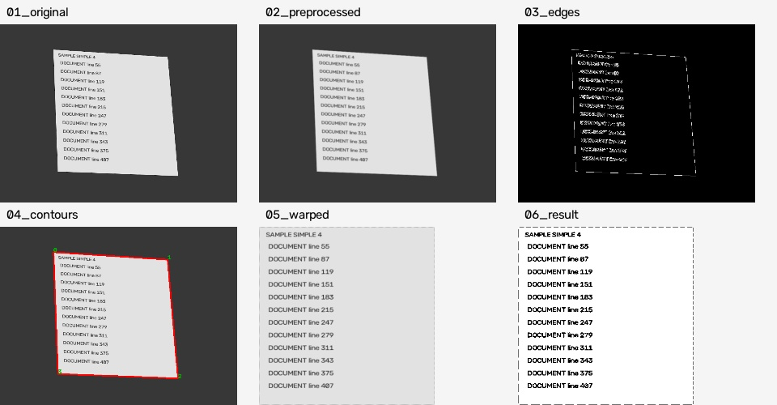
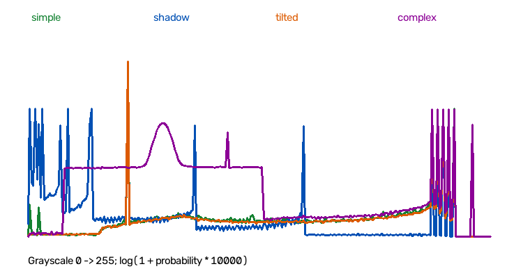
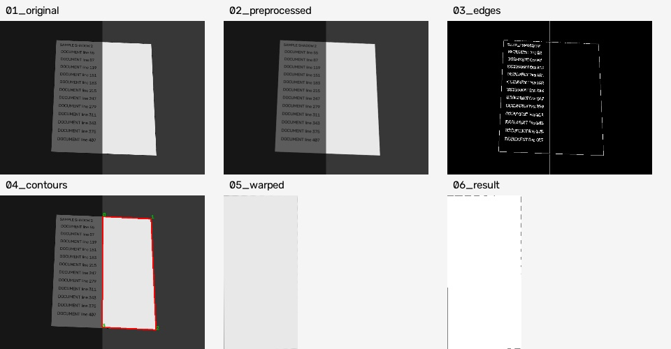
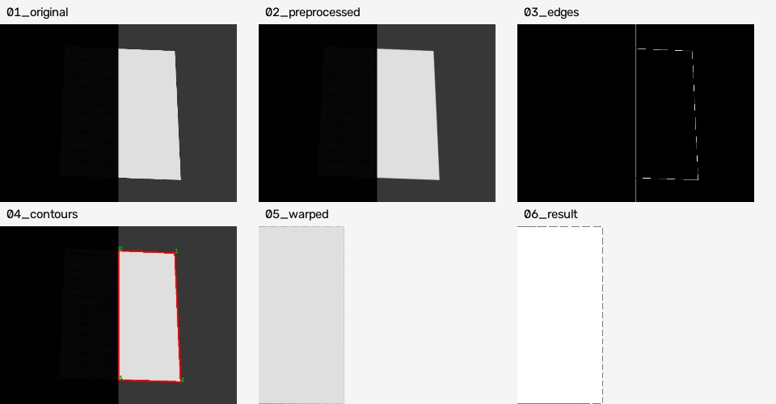
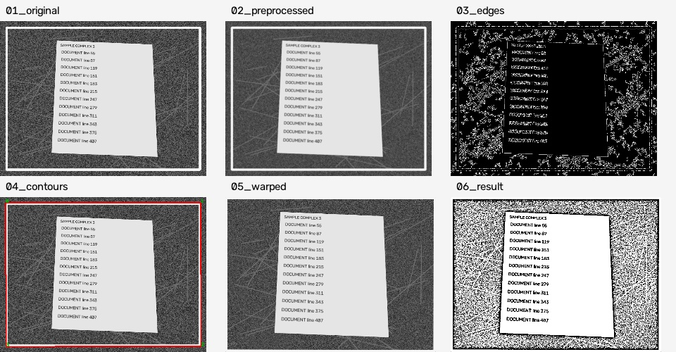
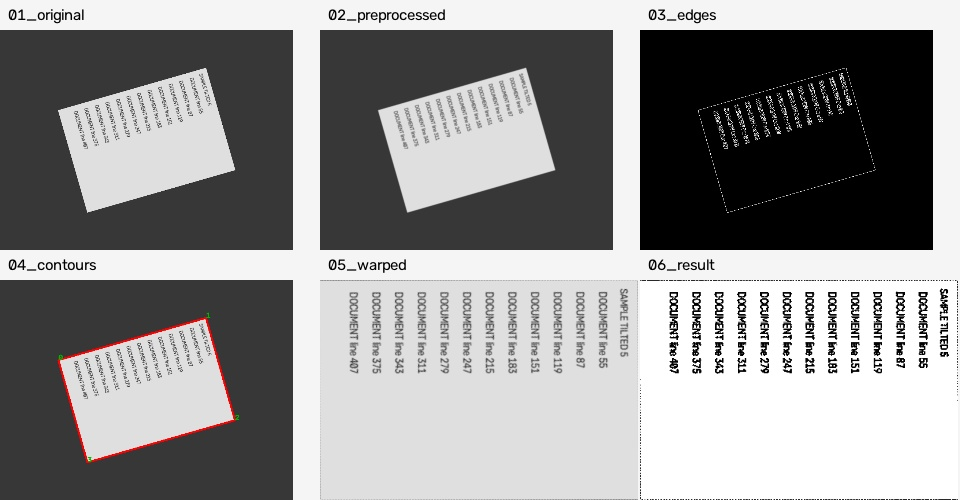
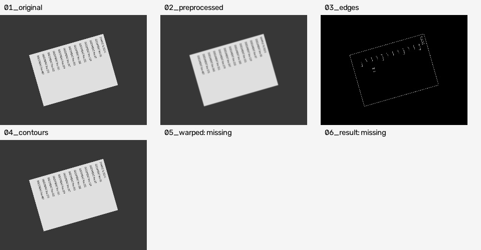

# 문서 스캐너 분석 보고서

## 데이터 출처와 평가 방법

사용자 요청에 따라 OpenCV·NumPy로 생성한 **합성 이미지 20장**을 사용했다. RNG seed는 19이며, 원본과 정답 좌표·조명·회전·배경 조건은 `examples/dataset/manifest.json`에 있다. 직접 촬영한 사진이나 LMS 표준 데이터의 측정값으로 해석해서는 안 된다.

단순 배경 5장은 A4·영수증·명함 형태의 폭/높이와 꼭짓점 위치를 달리했다. 그림자 5장은 화면 왼쪽에 밝기 배율 0.65, 0.4, 0.15, 0.08, 0.03을 적용했다. 회전 5장은 46°, 53°, 60°, 67°, 74°로 돌렸으며, 이는 **영상 평면 내 회전각**으로 실제 카메라의 광축에 대한 45° 이상 촬영각을 재현한 것은 아니다. 복잡한 배경에는 잡음·선분과 큰 사각형 방해물을 넣었다. 종이 텍스트도 합성이다. 실제 구김·반사·렌즈 왜곡은 측정 대상에 포함하지 않았다.

정답은 생성할 때 사용한 네 꼭짓점이다. 검출점과 정답점을 순환 대응시키고, 가장 큰 꼭짓점 거리를 이미지 대각선으로 나눈 오차가 0.03 이하이며 변환 결과가 있으면 자동 성공으로 정의했다. 800×600 이미지에서는 최대 30픽셀까지 허용하는 기준이다. 단순히 사각형을 찾았는지와 문서를 정확히 찾았는지를 구분한다. 글씨 판독성과 실제 종횡비는 이 수치로 보장되지 않는다.

검증 환경: Python 3.12.3, OpenCV 5.0.0, NumPy 2.5.3. OpenCV 버전별 윤곽선·근사 결과 차이로 경계 사례의 수치가 달라질 수 있다.

## 테스트 결과 요약

기본값은 Gaussian blur 5, Canny low/high 50/150, 최소 면적 비율 0.08, 다각형 근사 비율 0.02이다.

| 조건 | 테스트 수 | 성공 | 실패 | 성공률 |
|---|---:|---:|---:|---:|
| 단순 배경·정면 또는 약한 원근 | 5 | 5 | 0 | 100% |
| 그림자 있음 | 5 | 1 | 4 | 20% |
| 46–74° 평면 내 회전 | 5 | 5 | 0 | 100% |
| 복잡한 배경 | 5 | 2 | 3 | 40% |
| 전체 | 20 | 13 | 7 | 65% |

[전체 60회 측정표](examples/report.md)와 [원시 CSV](examples/results.csv)에 이미지별 성공 여부, 미검출/오검출, 정규화 오차를 기록했다. 각 단계의 원본 해상도 이미지는 평가 명령을 실행하면 `outputs/evaluation`에 생성된다.



## 밝기 분포 EDA

각 이미지의 256-bin 회색조 히스토그램을 픽셀 수로 정규화했다. `examples/eda.json`에는 개별 히스토그램, 평균, 표준편차, 5·95 백분위수를 저장했다. 아래 값은 각 조건에 속한 이미지별 통계량의 평균이다. 전체 픽셀을 합쳐 계산한 분위수와는 다르다.

| 조건 | 평균 밝기 | 표준편차 | 5백분위 | 95백분위 |
|---|---:|---:|---:|---:|
| simple | 102.84 | 75.92 | 55.00 | 229.00 |
| shadow | 73.48 | 77.87 | 14.00 | 229.00 |
| tilted | 97.38 | 73.95 | 55.00 | 229.00 |
| complex | 132.10 | 76.44 | 45.00 | 229.00 |



단순 배경은 어두운 바탕과 밝은 종이의 봉우리가 분리된다. 그림자는 어두운 영역의 값을 0 쪽으로 옮기지만, 밝은 반쪽은 그대로 남아 전체 표준편차가 오히려 커질 수 있다. 따라서 전체 명암 대비가 크다는 사실만으로 외곽선 검출이 쉽다고 판단할 수 없다.

밝기 배율 a를 곱하면 지역 밝기 차이와 이상적인 기울기도 대략 a배가 된다. 고정된 Canny 임계값에서는 어두운 반쪽의 외곽선이 끊길 수 있고, 새로 생긴 강한 그림자 경계가 종이 경계보다 우세해질 수 있다. 히스토그램은 픽셀의 공간 배치를 잃으므로 엣지 연결성을 단독으로 설명하지 못한다. 분포와 실제 엣지 이미지를 함께 확인해야 한다.

## 실패 사례와 파라미터 조정

비교한 설정은 다음과 같다. 블러와 임계값을 함께 바꿨으므로 아래 실험은 설정 조합 비교이며 개별 변수의 인과 효과를 분리한 실험은 아니다.

| 설정 | blur | low | high | 전체 성공 |
|---|---:|---:|---:|---:|
| default | 5 | 50 | 150 | 13/20 |
| sensitive | 3 | 10 | 40 | 13/20 |
| strict | 9 | 100 | 220 | 12/20 |

### 1. shadow_2: 그림자 경계를 종이 모서리로 선택

밝기 배율 0.4에서 기본 설정은 문서를 찾지 못했다. 민감 설정은 오차 0.1991, 강한 설정도 0.1991로 실패했다. 민감 설정의 결과를 확인하면 문서 오른쪽의 밝은 절반만 사각형으로 검출되어 글씨가 있는 왼쪽이 잘려 나갔다. 엣지를 더 많이 찾는 것이 올바른 문서 선택으로 이어지지 않는다.



### 2. shadow_5: 강한 그림자에서 영역 손실

밝기 배율 0.03에서는 기본·민감 설정 모두 오차 0.2002로 오검출했고, 강한 설정에서는 미검출로 바뀌었다. 강한 임계값은 오검출 후보를 없앴지만 올바른 문서를 되찾지는 못했다. 적응형 이진화는 이미 선택된 영역에만 적용되므로 잘려 나간 왼쪽 문서를 복구할 수 없다.



### 3. complex_3: 가장 큰 사각형은 문서가 아님

외곽의 밝은 프레임을 문서로 선택했다. 기본·민감·강한 설정 오차는 각각 0.2050 / 0.2057 / 0.2054로 모두 실패했다. 단계 이미지에서 실제 종이 주변의 배경까지 변환·이진화된 것을 볼 수 있다. 이 경우 병목은 엣지 검출만이 아니라 '가장 큰 사각형'이라는 후보 선택 규칙이다.



### 4. tilted_5: 강한 설정에서 유효 경계도 사라짐

74° 회전 사례에서 기본·민감 설정은 오차 0.0010으로 성공했지만 강한 설정은 사각형을 찾지 못했다. 블러·임계값 조합을 크게 하면 배경을 덜 검출할 수 있으나 유효한 문서 윤곽도 사각형 후보로 남지 않을 수 있다.





## 파라미터 딜레마와 규칙의 한계

시험한 세 설정 중 모든 이미지에 성공하는 설정은 없었다. 단순 배경 이미지 A인 `simple_4`에 잘 맞는 기본 설정도 이미지 B인 `complex_3`에서는 외부 사각형을 선택했다. `shadow_5`의 오검출을 없애는 강한 설정을 적용하면 `tilted_5`의 성공까지 잃는다. 오검출을 미검출로 바꾸는 것은 성공이 아니며, 측정 범위 밖의 모든 파라미터에 대해 최적값이 존재하지 않는다고 수학적으로 증명한 것은 아니다.

근사 오차 비율도 0.01 / 0.02 / 0.04 / 0.06으로 바꾸어 20장씩 추가 실행했다. 네 설정 모두 13/20이었으며 [추가 실험 기록](examples/epsilon_experiment.csv)에 남겼다. 다각형 근사 허용 범위를 조정하는 것만으로 이번 실패를 해결하지 못했다.

| 구현 규칙 | 실패할 수 있는 상황 |
|---|---|
| 가우시안 블러로 잡음 제거 | 작은 글자·약한 외곽도 흐려짐 |
| 고정 Canny low/high | 어두운 외곽 누락 또는 배경 엣지 증가 |
| 면적 8% 이상 | 멀리 찍힌 작은 문서가 탈락 |
| 네 꼭짓점·볼록한 도형 | 구겨짐·부분 가림·윤곽 단절에서 후보 없음 |
| 가장 큰 사각형 우선 | 프레임·책상·화면 오검출 |
| 중심 각도와 x+y로 좌표 정렬 | 기하 순서는 정하지만 글씨의 위쪽은 모름 |
| 평면 호모그래피 | 곡면·구김, 원래 종횡비를 복원하지 못함 |
| 지역 적응형 이진화 | 강한 그림자에서 소실된 정보·잘못된 크롭 복구 불가 |

이번 구현에서는 추가 후보 점수 규칙을 실험하지 않았다. '밝은 영역 우선' 또는 '종횡비 제한'은 후속 가설이지 검증된 해결책이 아니다. 밝은 프레임도 있고 영수증과 명함의 비율도 다르므로 규칙 추가에는 새로운 실패 가능성이 따른다. 관측한 근거는 임계값·블러·근사 비율 조정이 모든 실패를 해결하지 못했다는 데까지다.

## 학습 기반 접근이 필요한 이유

실패 사례에서 부족한 정보는 '어느 사각형이 문서인가'이다. 문서·배경 분할 또는 모서리 예측 모델을 실제 촬영 데이터와 정답으로 학습시키면 텍스트 배치, 종이 질감, 가림 맥락을 함께 이용할 수 있다는 가설을 세울 수 있다. 학습 시 그림자·배경·원근 증강을 적용하고, 학습에 쓰지 않은 문서와 촬영 환경을 분리해 검증해야 한다.

학습 모델도 강한 반사로 사라진 글자를 보장해서 복원하지 못하고, 합성 데이터에서만 학습하면 실제 사진으로 일반화하지 못할 수 있다. 본 프로젝트에서는 금지된 딥러닝 프레임워크·OCR 라이브러리를 사용하지 않았다. 개선 가설의 효과는 아직 측정하지 않았다.

## 재현과 남은 검증

```bash
python -m tools.generate_samples --output docs/examples/dataset
python -m tools.evaluate docs/examples/dataset/manifest.json --output outputs/evaluation --epsilon-sweep
python -m unittest discover -s tests -v
```

생성 이미지와 파라미터는 저장소에 포함되어 있다. 기본 테스트는 좌표 순열·마름모·퇴화 도형, 실제 투시 변환·이진화, 빈 이미지, 파일 오류와 저장, headless CLI, 잘못된 사각형의 평가 실패, 카메라 실패 시 자원 해제, 트랙바 값 변경 후 재처리를 검증한다.

GUI와 웹캠의 제어 흐름은 모의 실행으로 확인했으며 실제 데스크톱 표시·카메라 촬영은 검증하지 못했다. 직접 촬영/LMS 데이터 20장, 실제 촬영각·구김·반사에 대한 성능, 변환 결과 전체의 글씨 판독성과 물리적 종횡비 검토가 과제 원래 기준을 충족하려면 남아 있다.
